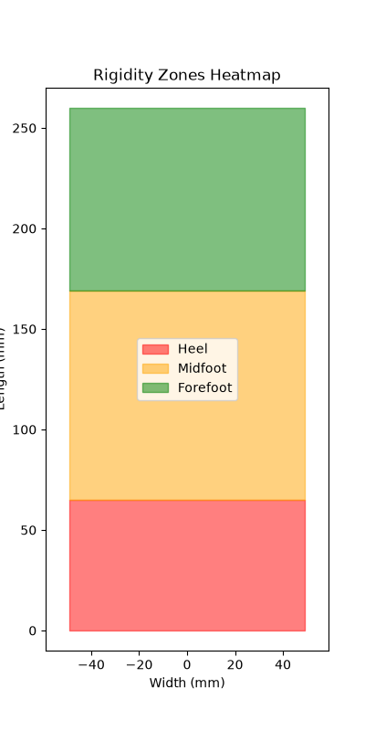
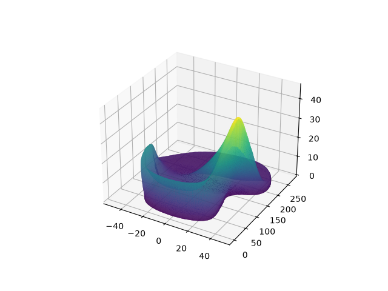
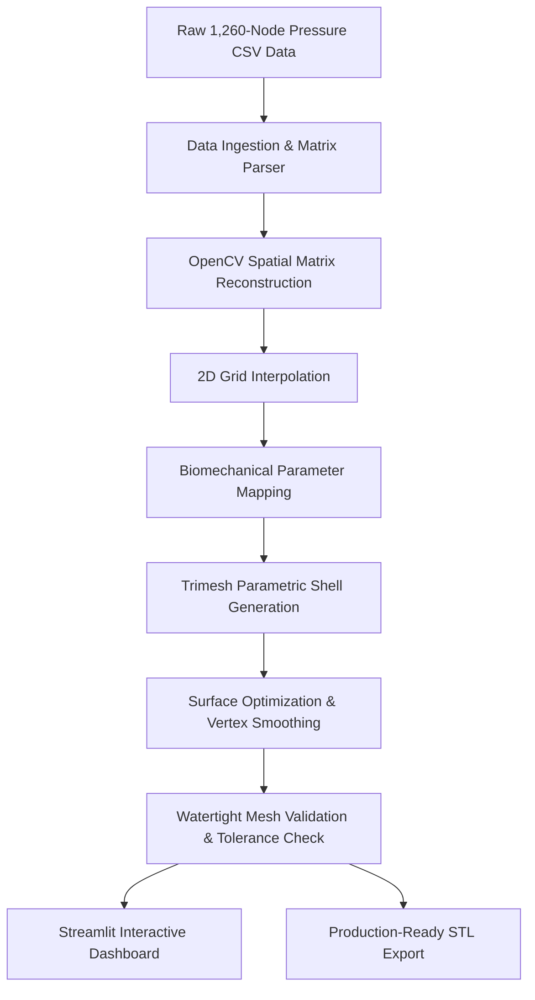

# Gaitform 🦶⚡
### *Automated 3D Biomechanical CAD Pipeline for Custom Orthotics*

[](https://www.python.org/)
[](https://opencv.org/)
[](https://trimesh.org/)
[](https://streamlit.io/)
[]()
[](LICENSE)

> 🔒 **PROPRIETARY RESEARCH & DEMONSTRATION NOTICE**  
> *Gaitform is an R&D demonstration prototype. Core proprietary heuristics, clinical decision parameters, and raw model weights remain confidential. This repository provides high-level functional architecture, matrix processing standards, and UI visualization tools.*

---

## 📸 Visual Showcase & 3D Render

| 2D Spatial Pressure Heatmap | Procedurally Generated 3D Mesh |
| :---: | :---: |
|  |  |

---

## 📌 Executive Summary

**Gaitform** is an automated biomechanical CAD generation pipeline that bridges spatial plantar pressure diagnostics with direct additive manufacturing. The system ingests raw **1,260-node spatial plantar pressure matrices** (derived from clinical sensor arrays or vision-based pressure estimation), performs spatial matrix interpolation, maps pressure concentrations to structural deformities, and procedurally generates custom, watertight **3D-printable orthotic shells** (STL/OBJ).

Engineered to strict clinical manufacturing criteria, Gaitform maintains a **dimensional tolerance of $\pm 1.5\text{ mm}$** across the footbed profile while incorporating dynamic surface optimization to eliminate stress concentrations prior to 3D printing.

---

## 🏗️ System Architecture



---

## 📁 Repository Asset Structure

```
gaitform/
├── assets/
│   ├── output_render.png             # Rendered 3D orthotic shell preview
│   ├── pressure_heatmap.png          # 2D interpolated spatial pressure map
│   └── shape_comparison.png          # Topological biomechanical comparison
├── data/
│   └── sample_pressure_data.csv      # Sample 1,260-node spatial pressure input
└── outputs/
    └── sample_orthotic_shell.stl     # Production-ready 3D printable STL model
```

* 📄 **Sample Input CSV**: [`data/sample_pressure_data.csv`](data/sample_pressure_data.csv)
* 📦 **Sample Output 3D STL**: [`outputs/sample_orthotic_shell.stl`](outputs/sample_orthotic_shell.stl) *(Viewable natively in 3D on GitHub)*

---

## 🛠️ Tech Stack & Dependencies

| Component | Library / Framework | Technical Purpose |
| :--- | :--- | :--- |
| **Language** | `Python 3.10+` | Core execution environment & numerical pipeline |
| **Matrix Processing** | `OpenCV (cv2)`, `NumPy` | Grid interpolation, spatial pressure heatmap synthesis |
| **3D CAD Generation** | `Trimesh`, `SciPy` | Parametric mesh construction, normal vector offset, STL serialization |
| **GUI & Visualization** | `Streamlit`, `Plotly` | Real-time interactive dashboard, 3D viewport, pressure visualizer |
| **Spatial Analysis** | `SciPy.ndimage` | Spatial kernel convolution & boundary conditions |

---

## 🔬 High-Level Mathematical Surface Optimization

To prevent localized stress fractures during walking and eliminate layer-adhesion defects during 3D printing, Gaitform applies spatial Gaussian filtering over the raw pressure topology before parametric mesh displacement.

### 1. Spatial Kernel Surface Smoothing
The spatial smoothing matrix $G(x, y)$ is calculated over a discrete neighborhood kernel size $k \times k$:

$$G(x, y) = \frac{1}{2\pi\sigma^2} \exp\left(-\frac{x^2 + y^2}{2\sigma^2}\right)$$

### 2. Mesh Vertex Displacement
Each base mesh vertex $\mathbf{v}_i = (x_i, y_i, z_i)^T$ is translated along its vertex unit normal vector $\hat{\mathbf{n}}_i$:

$$\mathbf{v}_i' = \mathbf{v}_i + \left( h_{\text{base}} + \alpha \cdot Z_{\text{smooth}}(u, v) \right) \hat{\mathbf{n}}_i$$

enforcing the strict manufacturing boundary:

$$\max_{\mathbf{v}} \|\mathbf{v}_{\text{generated}} - \mathbf{v}_{\text{nominal}}\| \le 1.5\text{ mm}$$

---

## 💻 Installation & Usage Guide

```bash
# Clone the repository
git clone https://github.com/Somesh4628/Engineering-Portfolio.git
cd Engineering-Portfolio/gaitform

# Create and activate virtual environment
python -m venv venv
# On Windows:
.\venv\Scripts\activate
# On Linux/macOS:
source venv/bin/activate

# Install dependencies
pip install -r requirements.txt

# Run the Streamlit Dashboard
streamlit run app.py
```

---

## 📜 License & IP Notice

Distributed under the **MIT License**. Core proprietary algorithms, clinical rules, and model weights remain confidential. See `LICENSE` for details.

---
*Maintained by [Somesh](https://github.com/Somesh4628)*
